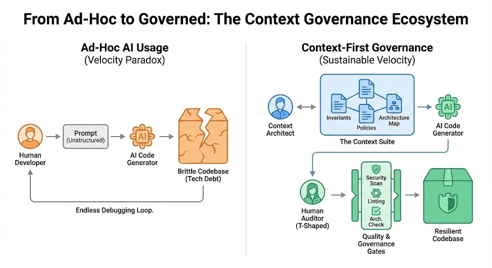

# Index

## Table of Contents

- [Instructions](Instructions.md)

### Chapters
- [00 Introduction](chapters/00-introduction.md)
- [01 Diagnosis](chapters/01-diagnosis.md)
- [02 Solution Architecture](chapters/02-solution-architecture.md)
- [03 Human Firmware](chapters/03-human-firmware.md)
- [04 Governance Workflow](chapters/04-governance-workflow.md)
- [05 Measuring Success](chapters/05-measuring-success.md)
- [06 Conclusion](chapters/06-conclusion.md)
- [07 Coding Practices](chapters/07-coding-practices.md)
  - [7.1 Understanding the Landscape](chapters/07-coding-practices/7.1-understanding-the-landscape.md)
  - [7.2 The Pragmatic Strategy](chapters/07-coding-practices/7.2-the-pragmatic-strategy.md)
  - [7.3 Tactics Implementation](chapters/07-coding-practices/7.3-tactics-implementation.md)
  - [7.4 Review Next Steps](chapters/07-coding-practices/7.4-review-next-steps.md)